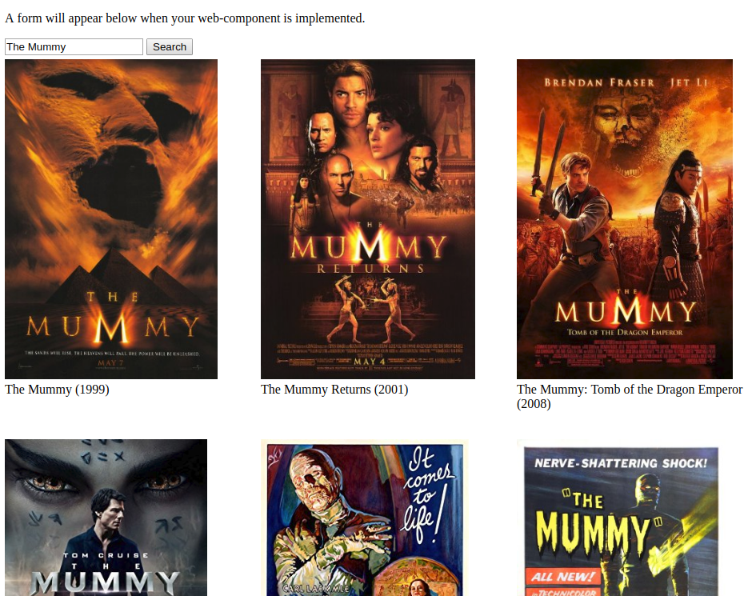

# Web Component

With this assignment we will create a native Web Component that will provide a movie database search field.

### Local Testing and Development Instructions

To test your code locally you must first install the dependencies. From within your project directory execute this command: 

```bash
npm install
```

Now that dependencies are installed you can test your code at any time with this command:

```bash
npm test
```

To help with the development of your web-component a small server has been set up. In the terminal, execute the command `npm start` to start the server. You should see output similar to this:

```bash
npm start

> web-component@1.0.0 start web-component
> node server/index.js

Server listening on port 33231
```

Notice the last line displays the port number that the server is listening on.

- Open your browser to `http://localhost:<port>` where `<port>` is the port that the server is running on.
- You will not need to restart the server while developing your web component.


### Objectives

- Create a custom web component
- Interact with an API
- Emit custom events

### Example Finished Product



### Resources

- [Web Components](https://developer.mozilla.org/en-US/docs/Web/Web_Components)
- [Custom Events](https://developer.mozilla.org/en-US/docs/Web/API/CustomEvent/CustomEvent)
- [Using Fetch](https://developer.mozilla.org/en-US/docs/Web/API/Fetch_API/Using_Fetch) - for AJAX requests
- [Open Movie Database API](https://www.omdbapi.com/) - for performing actual searches


### Instructions

1. Locate the `public` directory within the project directory.

    - There is an `index.html` file. Do not alter this file.
    - There is a `movie-search.js` file. This is where you'll do all the work.
    - There is a `movie-search-results.js` file. You can use this file as an example for the movie-search component you'll be building. The movie-search-results component will display the results of the search performed by the movie-search component. You just need to get the movie-search component set up properly for the movie-search-results component to display results.

2. You're web component must fit the following criteria:

    - Exactly one text input.

    - Exactly one button.

    - Setting the component value updates the input value and sets the component's value attribute:

        `document.querySelector('movie-search').value = 'Some movie name';`

    - Getting the component value gets the input value:

        `var value = document.querySelector('movie-search').value;`

    - Setting the component value attribute updates the input value:

        `document.querySelector('movie-search').setAttribute('value', 'Some movie name');`

    - Getting the component value attribute gets the input value:

        `var value = document.querySelector('movie-search').getAttribute('value');`

    - Has a `search` property that executes the search using fetch:

        `document.querySelector('movie-search').search();`

        During your initial testing you can use fetch to make a request to `/api/the-mummy` to get back mock data: `fetch('/api/the-mummy')`

         Although not required for the assignment, it's just a little more work to get back real search results: `fetch('http://www.omdbapi.com/?s=' + searchTerm + '&apikey=' + yourApiKey, { mode: 'cors' })`

    - Clicking the button executes the `search` function.

    - Search emits two events:

        1. `search-initiated` with the search term in the event `detail` property

        2. `search-results` with an array of the search results in the event `detail` property.

3. Submit the assignment.